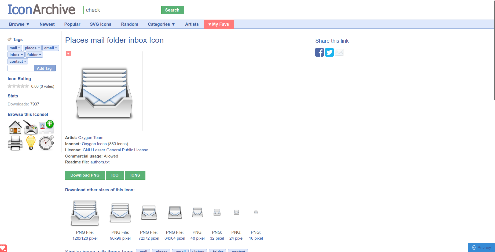
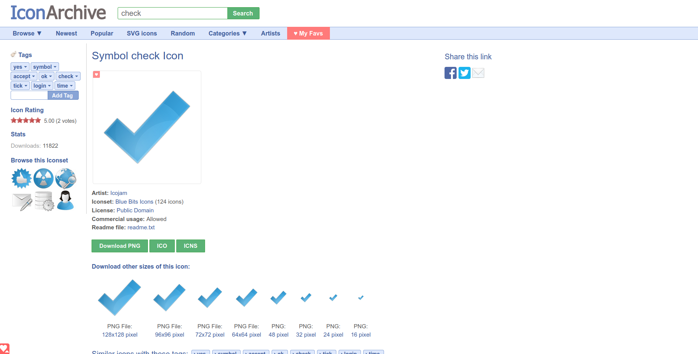

The icon for this extension is a merge of the following two icons.

= First Icon
image::Places-mail-folder-inbox-icon.png[link=Places-mail-folder-inbox-icon.png, 64, 64]

Taken from https://iconarchive.com/show/oxygen-icons-by-oxygen-icons.org/Places-mail-folder-inbox-icon.html[IconArchive]:
 +
Taken at May 15th, 2022. +
License is: GNU Lesser General Public License

= Second Icon

Taken from https://iconarchive.com/show/blue-bits-icons-by-icojam/symbol-check-icon.html[IconArchive]:
 +
Taken at May 15th, 2022. +
License is: Public Domain

= Merged file
These two icons are merged in the icon256.psd file, each in a seperate layer +
The image of the icons were not modified.
